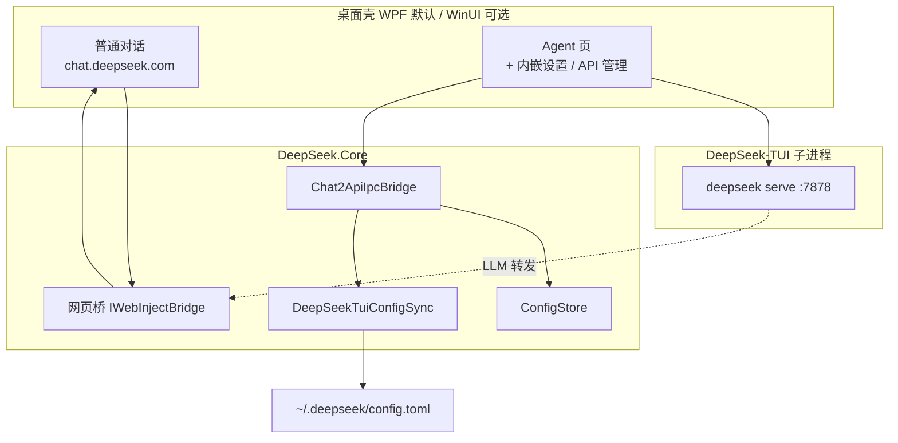

# DeepSeek Desktop

将 [DeepSeek 网页版](https://chat.deepseek.com) 封装为 Windows 桌面应用：**普通对话**嵌入官网；**Agent 工作台**与 **设置 / API 管理** 在应用内完成，核心逻辑集中在 `DeepSeek.Core`（DeepSeek-TUI 运行时 + 内嵌 Chat2API 管理台 + 网页会话桥）。

> **免责声明：** 本仓库为第三方独立开源项目，与 DeepSeek、Qwen Code（@qwen-code/qwen-code）及任何独立 Chat2API 开源项目**无隶属、无授权、无背书关系**。使用本软件须自行遵守各第三方服务条款与适用法律。详见 **[DISCLAIMER.md](./DISCLAIMER.md)**。

---

## 功能亮点

| 模块 | 说明 |
|------|------|
| **普通对话** | WebView2 嵌入 `chat.deepseek.com`，保留官网登录、深度思考、联网搜索 |
| **Agent 模式** | 内嵌 Agent 页 + [DeepSeek-TUI](third-party/DeepSeek-TUI) 引擎；LLM 经进程内通道 `internal://desktop/v1`，默认**不**依赖对外 HTTP 代理端口 |
| **API 管理（Chat2API UI）** | 在 Agent 面板内嵌打开（非独立弹窗）；界面汉化；与桌面配置、TUI `~/.deepseek/config.toml` 双向同步 |
| **设置** | Agent 内嵌设置页：MCP、工作区、TUI、Chat2API 摘要、登录态检测 |
| **DeepSeek.Core** | 共享库：配置、Chat2API 兼容层、MCP、TUI 客户端、工作模式等（`DeepSeek.Core.Tests` 回归） |
| **MCP** | 多 MCP 服务接入，与内置工具统一调度 |
| **Skills / Subagents** | 兼容 `.qwen/skills`、`~/.qwen/skills`、`.qwen/agents` |
| **外部 OpenAI API（可选）** | 在 API 管理或设置中手动开启；默认关闭 |
| **工作模式** | 普通对话 / Agent / 计划模式等，网页悬浮按钮与桌面状态同步 |

---

## 架构概览



**桌面栈联动：** API 管理页顶部展示登录态、内嵌通道、TUI 地址等；支持「同步到 TUI」「打开 TUI 配置」「打开主窗口登录」。

---

## 快速开始

### 环境

- Windows 10 / 11（x64）
- [.NET SDK](https://dotnet.microsoft.com/download)（WPF 壳：`net10.0-windows`；Core / WinUI：`net9.0`）
- [WebView2 运行时](https://developer.microsoft.com/microsoft-edge/webview2/)
- 构建 Chat2API 内嵌 UI 时需本机 [Node.js](https://nodejs.org/)（`scripts/build-chat2api-ui.ps1` 会尝试编译上游 renderer；仓库已附带构建产物 `Assets/chat2api/`）

### 克隆

```powershell
git clone --recurse-submodules https://github.com/fanstars2318/deepseek-desktop.git
cd deepseek-desktop
# 若已克隆但未拉取 submodule：
git submodule update --init --recursive
```

### 构建与运行

```powershell
# 默认：WPF 壳 + 内嵌 Chat2API 资源 + DeepSeek-TUI 二进制
.\build.ps1

# 指定输出目录（例如桌面文件夹）
.\build.ps1 -DeployDir "$env:USERPROFILE\Desktop\DeepSeek_desktop"

# 实验性 WinUI 3 壳（需本机 Windows App Runtime 正常）
.\build.ps1 -WinUi

# 从 submodule 源码编译 TUI（需 Rust 1.88+）
.\scripts\ensure-rust.ps1
.\build.ps1 -BuildTuiFromSource

# 运行
.\publish\DeepSeek.exe
```

### 回归测试

```powershell
dotnet test DeepSeek.Core.Tests
.\scripts\verify-integration.ps1
.\scripts\smoke-test.ps1
.\scripts\agent-tui-smoke.ps1   # 需已在普通对话登录
```

### 首次使用

1. 启动应用，在 **普通对话** 登录 DeepSeek 网页账号。  
2. 打开 **Agent**，在侧栏使用 **设置** 或 **API 管理**。  
3. 在 API 管理页可查看桌面栈状态，点击 **同步到 TUI** 将配置写入 DeepSeek-TUI。  
4. 按需配置 MCP、工作区、审批模式等。

---

## DeepSeek-TUI submodule

Agent 引擎来自 [`third-party/DeepSeek-TUI`](third-party/DeepSeek-TUI)（submodule，默认 **v0.8.39**）。说明见 [third-party/README.md](third-party/README.md)。

- 发布包默认捆绑 `deepseek.exe` / `deepseek-tui.exe`（由 `build.ps1` 下载或本地提供）  
- `DeepSeekTuiHost` 启动 `deepseek serve --http`（默认 `:7878`）  
- 集成元数据：`%LocalAppData%\deepseek_desktop\chat2api-tui-integration.json`

---

## Agent 命令速查

| 命令 | 作用 |
|------|------|
| `/help` | 显示帮助 |
| `/clear` | 清空当前对话 |
| `/react` | ReAct 单 Agent |
| `/plan` | 计划 + 子 Agent |
| `/chat` | 返回普通网页对话 |
| `/skills` | 列出 Skills |
| `/skills <名> [任务]` | 加载 Skill 并执行 |
| `/agents` | 列出 Subagents |
| `/agents <名> <任务>` | 委派 Subagent |
| `!<命令>` | 直接 Shell（需审批） |
| `@路径` | 注入工作区文件 |

---

## 配置与数据目录

| 路径 | 内容 |
|------|------|
| `%LocalAppData%\deepseek_desktop\config.json` | 登录 Token、MCP、模型映射、API 开关等 |
| `%LocalAppData%\deepseek_desktop\agent-sessions\` | Agent 会话 |
| `%LocalAppData%\deepseek_desktop\User Data\` | WebView2 用户数据 |
| `%LocalAppData%\deepseek_desktop\chat2api-tui-integration.json` | 桌面 ↔ TUI 集成快照 |
| `~/.deepseek/config.toml` | DeepSeek-TUI 配置（由桌面同步写入） |

主要字段见 `DeepSeek.Core/Models/AppConfig.cs` 与根目录 `Models/AppConfig.cs`（WPF 层扩展）。

---

## 项目结构

```
deepseek-desktop/
├── DeepSeek.Core/              # 共享业务库
├── DeepSeek.Core.Tests/        # 单元测试
├── DeepSeek.Desktop/           # WinUI 3 壳（build.ps1 -WinUi）
├── DeepSeekBrowser.csproj      # WPF 壳（build.ps1 默认）
├── Assets/
│   ├── agent/                  # Agent / 内嵌设置 / API 管理宿主页
│   ├── chat2api/               # Chat2API 管理台静态资源（汉化 + 桌面栈条）
│   ├── chat2api-ui/            # 覆盖脚本与主题（构建时复制）
│   └── inject/                 # 官网页注入脚本
├── third-party/DeepSeek-TUI/   # git submodule
├── scripts/                    # 构建、验证、冒烟脚本
└── build.ps1
```

---

## Chat2API 内嵌 UI 维护

上游 UI 来自 Chat2API renderer；本仓库通过 `scripts/build-chat2api-ui.ps1` 打包并打补丁：

- 移除 About 页与语言切换（固定 **zh-CN**）  
- 注入 `ds-theme-override.css`、`ds-desktop-stack.js`、`webview-preload.js` 等  
- 经 Agent iframe → `Chat2ApiIpcBridge` 对接桌面配置与 TUI  

重新生成 UI：

```powershell
.\scripts\build-chat2api-ui.ps1
# 可选：-Chat2ApiSource 指向上游 Chat2API 源码目录
```

---

## 技术栈

- **.NET** · **WPF**（默认）/ **WinUI 3**（可选）· **WebView2**
- **DeepSeek-TUI** · **DeepSeek.Core** · **MCP**
- 推理默认经内嵌通道使用网页登录会话

---

## 常见问题

**API 管理显示「未登录」？**  
先在普通对话完成网页登录，或在 API 管理页点击「打开主窗口登录」。

**与 npm 版 Qwen Code 的关系？**  
本仓库在 C# 中实现/移植部分 Core 能力，由 DeepSeek 桌面 Agent 调度；默认不启动 `qwen` CLI 子进程。

**Git 推送失败？**  
可配置代理，例如：`git -c http.proxy=http://127.0.0.1:7890 push`。

---

## 相关链接

- 仓库：https://github.com/fanstars2318/deepseek-desktop  
- [Qwen Code 架构](https://qwenlm.github.io/qwen-code-docs/zh/developers/architecture/)  

---

## 免责声明与贡献

完整条款见 **[DISCLAIMER.md](./DISCLAIMER.md)**。欢迎 Issue / PR；请勿提交含 Token 的 `config.json` 或个人配置。

<p align="center"><sub>如果这个项目对你有帮助，欢迎 Star ⭐</sub></p>
