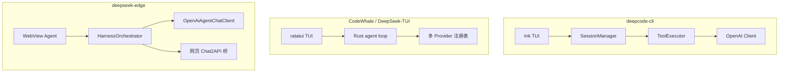

# Agent 能力对比：deepcode-cli · CodeWhale (DeepSeek-TUI) · DeepSeek Desktop

基准：**以 [deepcode-cli](https://github.com/lessweb/deepcode-cli) 的 OpenAI tools + 直连 API 执行标准为准**（`file_path`、`offset`/`limit`、ReAct 循环、权限 scope）。

参考仓库：

| 项目 | 路径 | 上游 |
|------|------|------|
| deepcode-cli | `deepcode-cli-main` | https://github.com/lessweb/deepcode-cli |
| CodeWhale | `DeepSeek-TUI-main` | https://github.com/Hmbown/CodeWhale |
| 本仓库 | `deepseek-edge` | DeepSeek Desktop + DSD Harness |

---

## 沙盒优先决策（明确不实施项）

| deepcode-cli | DeepSeek Desktop |
|--------------|------------------|
| Git Bash **持久 shell 会话**（脱离 projectRoot 边界） | **不采用** — 破坏 `LocalWorkspaceSandbox` 工作区隔离 |
| 宿主机任意 cwd | **保留** `LocalWorkspaceSandbox` + `HarnessSandboxCoordinator` |
| cmd 单次执行 | **已增强**：`HarnessShellRunner` 超时、流式 stdout、`taskkill /T /F` 杀进程树 |

所有 `bash` / `run_shell` 经沙盒 `ExecuteShellAsync` 执行，`WorkspaceRoot` 为 cwd 边界；`cd` 仅在同工作区键下记忆目录。

---

## 一、架构对照

| 维度 | deepcode-cli | CodeWhale (TUI) | DeepSeek Desktop |
|------|--------------|-----------------|------------------|
| 壳层 | 终端 Ink | 终端 ratatui | WPF + WebView2 |
| 默认推理 | 直连 API | 多 Provider | **双通道**：网页桥 + 可选 API |
| 工具协议 | OpenAI `function` | Provider 原生 tools | OpenAI tools **或** Harness XML |
| 工作区 | `projectRoot` cwd | workspace 相对路径 | 虚拟路径沙盒 `/mnt/user-data/...` |

---

## 二、工具能力矩阵（deepcode 标准）

| 工具 / 能力 | deepcode-cli | CodeWhale | deepseek-edge | 说明 |
|-------------|:------------:|:---------:|:-------------:|------|
| `read` + offset/limit | ✅ | ✅ read_file | ✅ | `HarnessReadFileTool` |
| `read` 图片 + follow-up | ✅ | — | ✅ | API 模式 `image_url` system follow-up |
| `read` PDF + pages | ✅ | — | ✅ | `pages` 参数；大 PDF 需指定范围 |
| `image_analyze` | — | ✅ | ✅ | 独立 vision 模型（设置页可配） |
| `write` / `edit` | ✅ | ✅ | ✅ | 写前 checkpoint（`HarnessFileHistory`） |
| `bash` 持久 Git Bash | ✅ | — | ❌ **故意不做** | 见「沙盒优先」 |
| `bash` 流式 stdout | ✅ | ✅ | ✅ | `agentShellOutput` |
| `bash` timeout / 杀进程树 | ✅ | ✅ | ✅ | `HarnessShellRunner` + `HarnessProcessTree` |
| `AskUserQuestion` / `UpdatePlan` / `WebSearch` | ✅ | 部分 | ✅ | |
| `list_dir` / `grep` / `glob` | 部分 | ✅ | ✅ | |
| MCP 动态 tools | ✅ | ✅ | ✅ | `mcp` scope |

---

## 三、LangGraph · AutoGPT · Skill 生态对照

| 维度 | LangGraph | AutoGPT | antigravity / awesome-claude-skills | DeepSeek Desktop |
|------|-----------|---------|-------------------------------------|------------------|
| 工作流 | 声明式图 + checkpoint | Block 管道 | — | `HarnessGraphRunner` + `HarnessBlockRegistry`（可选 strategy） |
| 中断/恢复 | `interrupt` + thread | 人工审批节点 | — | `type: interrupt` · `/resume thread <id>` |
| 技能 | LangChain tools | Block 插件 | 800+ SKILL.md | `HarnessSkillRegistry` + `AgentSkillExtraRoots` 索引 |
| 可观测 | Langfuse 等 | 内置日志 | — | `HarnessRunTracer` · `~/.deepseek/runs/` |
| 运行时 | Python | Python | Markdown | **C# Harness**（不引入 Python） |

参考仓库只读 clone：`scripts/setup-reference-repos.ps1` → `C:\Users\xiaow\Desktop\DSD\{langgraph,AutoGPT,...}`。模式映射见 [AGENT_PATTERNS.md](./AGENT_PATTERNS.md)。

---

## 四、会话与 UX

| 功能 | deepcode-cli | deepseek-edge |
|------|:------------:|:-------------:|
| `/undo` 对话 + 代码 | ✅ UndoSelector | ✅ `agentUndoList` / `agentUndoRestore` + WebView 选择器 |
| `@` 文件引用 | ✅ | ✅ `agentWorkspaceReadSnippet` |
| 权限 scope | ✅ read/write/bash/mcp/network | ✅ `HarnessPermissionPlan` + WebView 审批 |
| 网页模式多模态 | — | ⚠️ 降级为文本提示（请切 API 或 `image_analyze`） |

---

## 五、配置要点

- **Vision**：`AgentVisionModel` / `AgentVisionApiBaseUrl` / `AgentVisionApiKey`（设置页）
- **Bash 超时**：`AgentBashTimeoutMs`（默认 600000）、`AgentBashMinTimeoutMs`
- **Scope 策略**：`AgentPermissionScopesJson`（`{"write":"allow"}` 等）

详见 [HARNESS.md](./HARNESS.md)。

---

*MIT 参考项目移植时请保留 attribution，勿整文件复制 UI 资源。*
