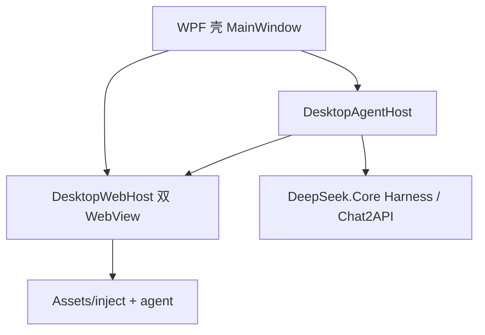

# DeepSeek Desktop 架构（deepseek_desktop）

## 分层

| 层 | 职责 | 禁止 |
|----|------|------|
| **WPF** (`MainWindow`, `Views/`) | 窗口、托盘、WebView 容器、加载遮罩 | 业务编排、工具执行 |
| **Services** | 消息路由、WorkMode、Chat2API IPC、注入 | 直接修改 Harness 策略 |
| **DeepSeek.Core** | Agent Harness、配置、Chat2API 兼容层 | WPF / WebView2 引用 |
| **Assets** | 预构建 UI、注入脚本 | C# 业务逻辑 |

## 工作模式

- **状态机**：`WorkModeCoordinator`（唯一 mode 源）→ `WorkModeStatePayload.For` → 双 WebView `workModeState`
- **普通页按钮**：`chat-mode-floater.js`（右上角 pill）+ `ChatModeFloaterScript.MinimalMount` 兜底
- **Agent 页按钮**：`Assets/agent/index.html` `#mode-float`
- **切换**：`toggleWorkMode` → `DesktopAgentHost` → `ApplyWorkMode` → `ShowChat` / `ShowAgent`

## 桌面 UX（流畅度）

- **双 WebView 保活**：`ShowChat` / `ShowAgent` 仅显隐 + 对称 CrossFade（~120ms），避免整页重载。
- **Loading 遮罩**：`ChatNavigationPolicy` 仅在跨 path 整页导航时显示；同 path 的 SPA/hash 变化不遮罩。
- **注入**：`InjectScheduler` debounce；`WebInjectService.RunScheduledInjectAsync` 收敛为最多 3 次脚本触发。
- **追踪**：`DesktopUiTrace` → `logs/desktop-ui-trace.log`；模式切换仍用 `work-mode-trace.log`。

## 发布

- 唯一日常入口：`publish/DeepSeek.exe`（`build.ps1`）
- 门禁：`verify-integration.ps1`、`verify-workmode-ui.ps1`、`verify-desktop-smoothness.ps1`、`audit-supply-chain.ps1`、`scan-secrets.ps1`

## 同步策略

- 开发主仓：`deepseek_desktop`
- 归档：`deepseek-edge` 仅单向 `scripts/sync-to-deepseek-desktop.ps1`，勿反向覆盖
