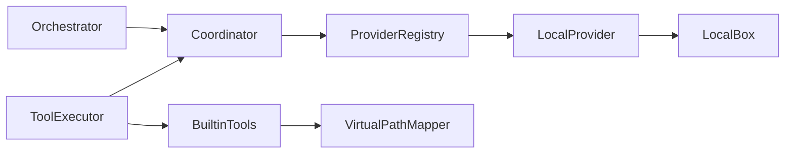

# DeepSeek Edge Agent Harness（DSD Harness）

> **日常使用**：见 [AGENT_USER_GUIDE.md](./AGENT_USER_GUIDE.md)（设置、命令、Token 优化、验收脚本）。

## 定位

**Agent = Model + Harness**（原创运行时；学习 Harness 4.0 / DeerFlow 思想，非拷贝）

| 层 | 模块 | 职责 |
|----|------|------|
| **Model** | `WebChatBridgeHost` + `bridge.js` | 网页 DeepSeek 会话、流式、`<tool_calling>` |
| **L1 Capability** | `HarnessToolRegistry` · `BuiltinToolExecutor` · `McpHub` | 工具 + 工作区沙箱 |
| **L2 Channel** | `IAgentWebChat` · DSD API | 模型通道 |
| **L3 Composer** | `HarnessComposer` · `HarnessMemoryLoader` · `HarnessPlaybookRegistry` | Phase 提示 + 记忆 + Playbook |
| **L4 Control** | `HarnessOrchestrator` · `HarnessSelfValidator` · `HarnessCheckpointStore` · `HarnessSandboxCoordinator` | 循环、自检、检查点、沙箱生命周期 |

## 与参考项目的对应（借鉴 ≠ 抄袭）

| 参考 | 借鉴思想 | DSD 原创实现 |
|------|----------|--------------|
| **Harness 4.0** | L0–L3 记忆、检查点、领域路由、输出自检 | `~/.deepseek/memory/` + `HarnessMemoryLoader` + `HarnessSelfValidator` |
| **DeerFlow Sandbox** | Acquire / Inject / Release · Provider 单例 · 虚拟路径 | `Harness/Sandbox/*` + `HarnessVirtualPathMapper` |
| **KTtao / agent-skills** | 分阶段 Playbook | `~/.deepseek/playbooks/` + Phase 状态机 |

市场互操作详见 [INTEROP.md](./INTEROP.md)：MCP · SKILL.md · OpenAI tools schema。

多智能体（梦之队 / `delegate_agent`）详见 [MULTI_AGENT.md](./MULTI_AGENT.md)。

## Phase 状态机

Orient → Explore → Blueprint → Execute → Verify（可选）

- **默认 Execute**：日常对话与任务执行；`/blueprint` 或设置中切换 Blueprint
- **Blueprint 模式（Plan）**：Explore → Blueprint（需有工具 Observation 或达到调研轮次上限才进入蓝图）
- **Execute 模式**：全工具 + 可选 Verify 验收

## DeerFlow 风格沙盒（本地）

三层结构（见 `DeepSeek.Core/Services/Harness/Sandbox/`）：

| 层 | 类型 | 职责 |
|----|------|------|
| Coordinator | `HarnessSandboxCoordinator` | Run 开始 Acquire/Inject · 首个内置工具 `EnsureInitialized` · Run 结束 Release |
| Provider | `HarnessSandboxProviderRegistry` → `LocalWorkspaceSandboxProvider` | 进程内单例 · 按 sessionId 复用 Box |
| Sandbox | `LocalWorkspaceSandbox` | `run_shell` 在工作区根执行；输出反向虚拟化 |



### 虚拟路径（Agent 侧统一使用）

| 虚拟路径 | 物理路径 | 权限 |
|----------|----------|------|
| `/mnt/user-data/workspace/` | `{工作区根}/` | 读写 |
| `/mnt/user-data/outputs/` | `{工作区根}/outputs/` | 读写 |
| `/mnt/user-data/uploads/` | `{工作区根}/uploads/` | 只读 |
| `/mnt/skills/` | `~/.deepseek/skills/` | 只读 |

工具入参可为虚拟路径或相对路径；`list_dir` / `grep` / `glob` / `run_shell` 输出中的路径会虚拟化，避免模型看到 Windows 绝对路径。

### 配置

- `AgentSandboxLazyInit`：默认 `true`（首个**内置工具**调用时再 Acquire；不仅是 `run_shell`）
- `false`：Run 开始前即 Acquire（eager）

### Session 复用

- `HarnessRunState.SandboxSessionId` 由 `RunId` / `WebChatSessionId` 确定性哈希生成（`HarnessSandboxSessionIds`），同会话多轮 Run 可复用 Provider 内 Box。

### 安全

- `WorkspacePathGuard`：物理路径不得越出工作区（相对路径场景）
- `HarnessShellGuard`：`run_shell` 前拦截 `format`、`del /s`、`powershell -enc` 等高危模式
- 本地沙盒仍在宿主机执行 cmd，生产环境请保持 `AgentAllowShell` 与审批策略收紧

应用退出时 `ShutdownCoordinator` 调用 `HarnessSandboxProviderRegistry.Shutdown()` 释放 Provider。

## 双推理通道与 OpenAI Tools（DeepCode 对齐）

| 设置 | 字段 | 说明 |
|------|------|------|
| 推理通道 | `AgentInferenceMode` | `web`（默认，网页 + DSD API）或 `api`（直连 OpenAI 兼容 API） |
| 工具协议 | `AgentToolCallingProtocol` | `xml` 或 `openai`；API 模式自动启用 OpenAI tools |
| API | `AgentApiBaseUrl` / `AgentApiKey` | 直连模式凭据 |
| 推理强度 | `AgentReasoningEffort` | `high` / `max`（写入 API extra_body） |
| 思考展示 | `AgentThinkingDisplayMode` | Agent UI `/raw`：normal / lite / raw |

实现：`OpenAiAgentChatClient` · `HarnessOpenAiToolLoop` · `HarnessOpenAiBuiltinTools`（read/write/edit/bash + AskUserQuestion + UpdatePlan）。

网页模式若 DSD API 不支持 `tools`，可继续用 XML fallback；API 模式完整走 function calling。

### 决断摘要（默认）

| # | 主题 | 选择 |
|---|------|------|
| 1 | Skills 路径 | 扩展 `~/.agents/skills` · `./.deepcode/skills`（见 `HarnessInteropPaths`） |
| 2 | 权限 | 保留 `ApprovalGate`，OpenAI 工具名映射风险等级 |
| 3 | 计划 | `UpdatePlan` 轻量 checklist + Blueprint 并存 |
| 4 | 联网 | `smartSearch` + 可选 `WebSearch` tool（`AgentWebSearchScript`） |
| 5 | Shell | Windows cmd + 沙盒 + stdout 流式（非 Git Bash 持久 session） |

## 记忆与检查点

结构化 Run Trace 与语义记忆（Mem0 / Langfuse 本地子集）详见 [MEMORY_OBSERVABILITY.md](./MEMORY_OBSERVABILITY.md)。

```
~/.deepseek/
  core.yaml                 # L0 驾驭约束
  memory/
    semantic.db             # 语义记忆（embedding 检索）
    L2_behavior.yaml        # 行为偏好
    domains/
      registry.json         # 领域关键词路由
      coding/L3_cognitive.yaml
  session/checkpoint.json   # 断点续传（/checkpoint）
  playbooks/*.yaml          # Playbook 剧本
```

工作区可覆盖：`<workspace>/.deepseek/memory/`

## 本地验证

```powershell
dotnet test DeepSeek.Core.Tests
dotnet build DeepSeekBrowser.csproj -c Release
.\build.ps1
.\scripts\agent-hello-test.ps1    # 需已登录网页 Token
.\scripts\agent-task-smoke.ps1    # Execute + list_dir 任务自检
```

## Agent UI 命令

`/blueprint` · `/execute` · `/playbook <id>` · `/playbooks` · `/skills` · `/skill <id>` · `/graph list|run` · `/blocks` · `/resume thread <id>` · `/checkpoint` · `/reload` · `/phase` · `/mcp` · `/model` · `/runs` · `/trace` · `/memory` · `/undo` · `/init` · `/raw` · `@` 文件引用

图工作流与 Block 编排详见 [GRAPH_WORKFLOW.md](./GRAPH_WORKFLOW.md)；外部 Skill 合集索引见 [SKILLS_CATALOG.md](./SKILLS_CATALOG.md)。

## P2 能力

| 能力 | 模块 | 说明 |
|------|------|------|
| **大输出落盘** | `HarnessToolOutputSpill` | 工具 Observation 超 `AgentToolOutputInlineMaxChars`（默认 6000）时写入 `{workspace}/.deepseek/runs/{runId}/observations/`，上下文只保留摘要 |
| **Verify 链** | `HarnessVerifyChain` | Playbook `verify.steps[]` 或 `AppConfig.AgentVerifyCommands` 多步验收；必需步骤失败则中止后续 |
| **热重载** | `HarnessRegistryReload` | `/reload` 或 IPC `agentHarnessReload` 使 Playbook / Skill 缓存失效 |
| **复盘落盘** | `HarnessPostMortemWriter` | 任务结束写入 `{workspace}/.deepseek/runs/{runId}/postmortem.md`（`AgentWritePostMortem`，默认开） |

Playbook 多步 Verify 示例（`execute-with-verify.yaml`）：

```yaml
verify:
  steps:
    - command: dotnet build --no-restore -v minimal
      name: build
      optional: true
    - command: dotnet test --no-build --verbosity minimal
      name: test
      optional: true
```

## 参考仓库（只读）

运行 `scripts/setup-reference-repos.ps1` 将 LangGraph / AutoGPT / Skill 合集等 shallow clone 到 `C:\Users\xiaow\Desktop\DSD\`。clone 失败不阻塞 Harness 运行时；详见各对照文档。
