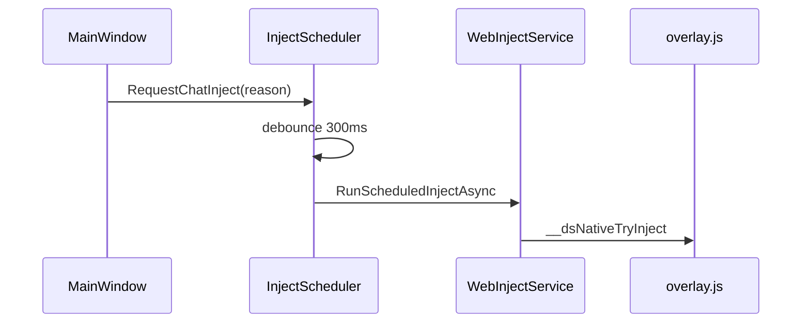

# 注入脚本职责

| 文件 | 作用 |
|------|------|
| `bridge.js` | WebView ↔ 宿主消息、token、原生能力 |
| `work-mode-client.js` | `DsWorkMode` 状态机、与 C# `workModeState` 同步 |
| **`chat-mode-floater.js`** | **仅** 普通对话页右上角 Agent/普通 pill |
| `overlay.js` | 官网页工具栏、路由监听、DSD API 嵌入增强 |
| `overlay.css` / `ds-theme.css` | overlay 样式 |

普通页模式按钮 **不要** 再写入 `overlay.js`（避免 React 重绘与体积耦合）。C# 在 `EnsureChatModeFloaterAsync` 中先执行 `MinimalMount`，再加载完整 floater 脚本。

## 注入调度（桌面流畅度）

- **唯一 C# 调度**：`InjectScheduler`（`MainWindow` / `DesktopWebHost`），禁止在导航回调里直接多段 `BurstInjectAsync`。
- **页面内**：`overlay.js` 的 `scheduleBurstInject` 仅 soft retry（hard ≤3 次），SPA 依赖 `history` hook，不用高频 `location` 轮询。
- **追踪**：`%LocalAppData%\deepseek_desktop\logs\desktop-ui-trace.log`（`DesktopUiTrace`）。
- **验收**：`.\scripts\verify-desktop-smoothness.ps1`
