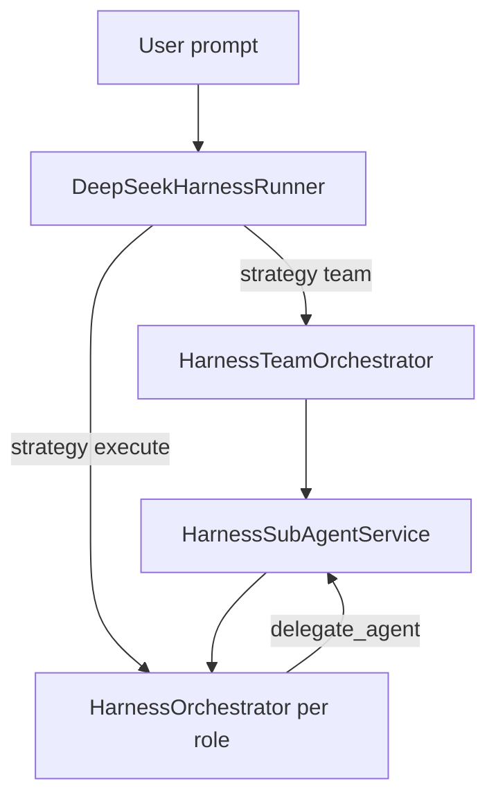

# 多智能体协作（梦之队）

借鉴 [AutoGen](https://github.com/microsoft/autogen)（委派对话）、[MetaGPT](https://github.com/FoundationAgents/MetaGPT)（SOP + 角色）、[CAMEL](https://github.com/camel-ai/camel)（角色扮演），在 **DSD Harness** 内实现，不引入 Python 运行时依赖。

参考源码（本地）：

| 框架 | 路径 |
|------|------|
| AutoGen | `C:\Users\xiaow\Desktop\DSD\autogen-main` |
| MetaGPT | `C:\Users\xiaow\Desktop\DSD\MetaGPT-main` |
| CAMEL | `C:\Users\xiaow\Desktop\DSD\camel-master` |

## 能力一览

| 能力 | 说明 |
|------|------|
| **Team SOP** | `strategy=team`：PM → Architect → Engineer → Reviewer 顺序执行 |
| **Parallel Explore** | `strategy=parallel-explore` 或 `parallel_explore` 工具：N 个只读 Explorer 并行扇出 + Plan 汇总（AutoGen 群聊式） |
| **Debate (CAMEL)** | `strategy=debate`：Advocate ↔ Critic 多轮辩论 + Moderator 总结 |
| **delegate_agent** | 主 Agent 工具：按角色派发子任务（AutoGen 式） |
| **角色策略** | explore/plan/review/implementer/verifier/advocate/critic + MetaGPT 职务 |
| **审计日志** | `~/.deepseek/team-audit/<session>.jsonl` |
| **并发上限** | `MaxConcurrentSubAgents`（默认 3） |

## 自动意图路由（无需用户指定工具 / Skill）

每次**新任务**（会话首条消息）在 Execute/Blueprint 主循环前：

1. 扫描已安装 **Skill** 与 **内置 + MCP 工具** 清单  
2. 用模型（可关）或启发式生成 JSON 规划：需求理解、推荐 `skill_id`、计划工具及是否可用  
3. 将「运行前意图分析」注入系统提示；高置信度时**自动加载 Skill 正文**  
4. 主 Agent 按规划调用工具，且不得使用清单外的 MCP 名  

配置：`AgentAutoIntentRouting`（默认开）、`AgentIntentUseLlmPlanner`（默认开；寒暄仍跳过）。

## 使用

### 梦之队工作流

- 斜杠：`/team` 或设置 strategy 为 `team`
- 发送任务后自动跑完四段 SOP，最终返回 Review 摘要 + 审计路径
- 可在设置中关闭 **EnableTeamWorkflow**

### 并行 Explore 扇出（AutoGen）

- 斜杠：`/parallel-explore` 或主 Agent 调用 `parallel_explore` 工具
- 默认 3 路透镜：结构 / 依赖 / 风险（受 **ParallelExploreFanOut** 与 **MaxConcurrentSubAgents** 约束）
- 设置：**EnableParallelExplore**

### CAMEL 辩论

- 斜杠：`/debate`
- **DebateMaxRounds** 轮 Advocate→Critic，最后由 Planner 角色 Moderator 汇总
- 设置：**EnableDebateWorkflow**

### 单步子 Agent

主 Agent（Execute + API tools）可调用：

```json
{
  "role": "explore",
  "task": "Find all references to HarnessOrchestrator",
  "context": "optional handoff markdown"
}
```

角色别名见 `HarnessAgentRoleRegistry`（与 DeepSeek-TUI `SUBAGENTS.md` 对齐）。

## 配置（AppConfig）

| 字段 | 默认 | 含义 |
|------|------|------|
| `EnableSubAgents` | true | 关闭后 `delegate_agent` 不可用 |
| `EnableTeamWorkflow` | true | 关闭后 `/team` 与 Team SOP 不可用 |
| `EnableParallelExplore` | true | 关闭后 `/parallel-explore` 与 `parallel_explore` 不可用 |
| `EnableDebateWorkflow` | true | 关闭后 `/debate` 不可用 |
| `MaxSubAgentSteps` | 10 | 每个子 Agent 最大工具轮数 |
| `MaxConcurrentSubAgents` | 3 | 并行委派上限 |
| `ParallelExploreFanOut` | 3 | 并行 Explore 扇出数量 |
| `DebateMaxRounds` | 3 | 辩论 Advocate↔Critic 轮数 |

## 架构



## 与三框架的对应

| 参考 | DSD 实现 |
|------|----------|
| AutoGen GroupChat / 委派 | `delegate_agent` + `HarnessSubAgentService.RunParallelAsync` |
| AutoGen 并行调研 | `HarnessParallelExploreOrchestrator` |
| MetaGPT 公司 SOP | `HarnessTeamOrchestrator` 四角色流水线 |
| CAMEL 角色扮演 | `HarnessDebateOrchestrator` + advocate/critic 角色 |
| MetaGPT 审计 | `HarnessTeamAuditLog` JSONL |

## 沙盒

子 Agent 与主 Agent 共用 `LocalWorkspaceSandbox` 与同工作区；角色仅限制工具（如 explore 禁止 write），不突破路径隔离。
